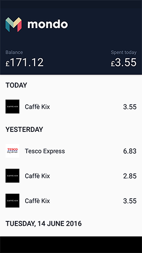

Mondo
======

This is an open source implementation of a transactions and balance view of a Mondo account (https://getmondo.co.uk)

Demo
======

Click the following image to see the app in action:

[](https://www.youtube.com/watch?v=-cIydpy1joY)

Building the app
======

You will need to specify two gradle properties to get the app working.

`MONDO_CLIENT_ID` and `MONDO_CLIENT_SECRET`

You can do this from the command line like so:

```sh
./gradlew installDebug -PMONDO_CLIENT_ID=your_client_id -PMONDO_CLIENT_SECRET=your_client_secret
```

Known issues
======

* The app doesn't implement the token refresh flow, which means that you will need to keep
re-authenticating when Mondo decides to invalidate your token

* If you want to open the project in Android Studio, you will need to install the
[Lombok IntelliJ plugin](https://plugins.jetbrains.com/plugin/6317)

* You can run the unit tests from the command line, but if you want to run the `model` unit tests,
you will need to have a JAVA 7 home environment set up as well if you are using JAVA 8 due to
retrolambda limitations

* All the acceptance tests work correctly, but there is a problem with the use of MockWebServer
which means that you can't run them all together (running them one by one works). Also, you will
need to have animations turned off on the device running the tests

Download
======

This app is, obviously, not on the Play store since I am not affiliated with Mondo, so the only way
to get this on your phone is to build from source. You can do that as described above by:


```sh
./gradlew installDebug -PMONDO_CLIENT_ID=your_client_id -PMONDO_CLIENT_SECRET=your_client_secret
```

License
-------

    Copyright 2016 Savvas Dalkitsis

    Licensed under the Apache License, Version 2.0 (the "License");
    you may not use this file except in compliance with the License.
    You may obtain a copy of the License at

       http://www.apache.org/licenses/LICENSE-2.0

    Unless required by applicable law or agreed to in writing, software
    distributed under the License is distributed on an "AS IS" BASIS,
    WITHOUT WARRANTIES OR CONDITIONS OF ANY KIND, either express or implied.
    See the License for the specific language governing permissions and
    limitations under the License.